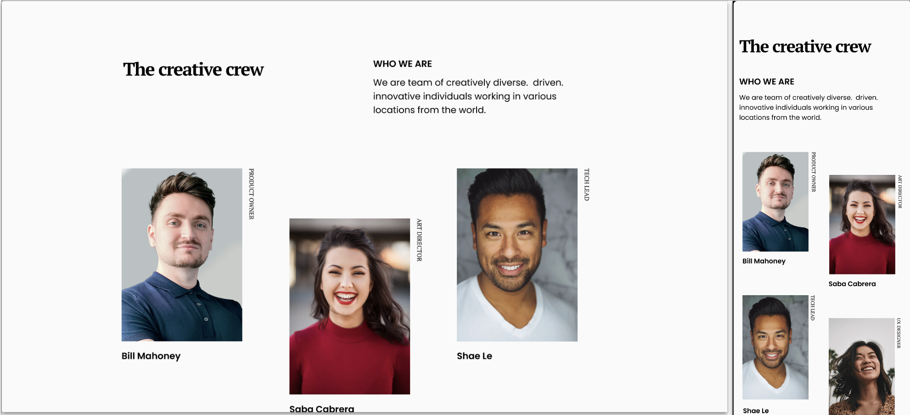

<!-- Please update value in the {}  -->

<h1 align="center">My Team Page</h1>

   Solution for a challenge from  <a href="http://devchallenges.io" target="_blank">Devchallenges.io</a>.

  <h3>
    <a href="https://anurag-pathak.github.io/My-Team-Page/">
      Demo
    </a>
     | 
    <a href="https://github.com/ANURAG-PATHAK/My-Team-Page">
      Solution
    </a>
     | 
    <a href="https://legacy.devchallenges.io/challenges/hhmesazsqgKXrTkYkt0U">
      Challenge
    </a>
  </h3>

<!-- TABLE OF CONTENTS -->

## Table of Contents

- [Overview](#overview)
  - [Built With](#built-with)
- [Features](#features)
- [Contact](#contact)

<!-- OVERVIEW -->

## Overview

Introduce your projects by taking a screenshot or a gif. Try to tell visitors a story about your project by answering:

This is a simple 404 Not Found webpage.

### Built With

<!-- This section should list any major frameworks you built your project using. Here are a few examples.-->

- HTML
- CSS

## Features

<!-- List the features of your application or follow the template. Don't share the Figma file here :) -->

This application/site was created as a submission to a [DevChallenges](https://devchallenges.io/challenges) challenge. The [challenge](https://legacy.devchallenges.io/challenges/hhmesazsqgKXrTkYkt0U) was to build an application to complete the given user stories.

## Contact

- [Website](https://anurag-pathak.github.io/Portfolio/)
- [GitHub](https://ANURAG-PATHAK)
- [Twitter](https://twitter.com/_Anurag__Pathak)
- [LinkedIn](https://www.linkedin.com/in/anuragpathak0/)
